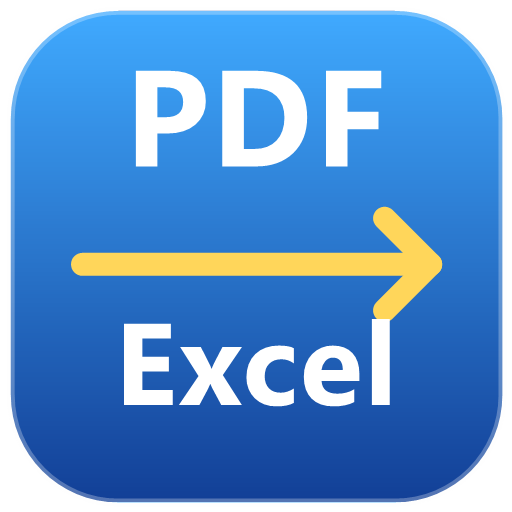

# PDF to Excel — Windows Desktop



**Same branding, same mission** as the Android version: convert PDF documents into a
single clean **Excel (.xlsx) sheet** — 100% offline, on your PC.

**by Er. Durgesh Pandey**

---

## About

- **App name:** PDF to Excel
- **Icon / logo:** the same gradient PDF→Excel mark as the Android app (`assets_win/icon.ico` embedded in the EXE, shown in the taskbar & title bar)
- **Window title:** `PDF to Excel`
- **Single-file EXE** (PyInstaller), no installation required, works offline.

> Folder: `PDF to Excel.exe` at the project root (produced by `BUILD EXE.bat`).

---

## Features

- 📄 Open **one or more PDF files** (or a whole folder) via a file dialog
- 🖼️ **Pictures embedded** in the PDF are placed into the workbook at their page position
- 📝 **Text + detected tables** extracted into cells with borders, fills, wrap and bold styling
- 📊 Auto column widths + auto-filter on the final sheet
- 📁 **Choose the output folder** yourself (or the file is saved next to the source)
- 📵 100% offline — nothing leaves your PC

## Screenshots

Drop your screenshots into `screenshots/` and reference them like:

```


```

---

## Install

1. Download **`PDF to Excel.exe`** (from Releases or the project root).
2. Double-click to run — no installer needed. Windows SmartScreen may warn the
   first time (unpublished developer); choose **More info → Run anyway**.

## How to use

1. **Add PDFs** — pick single/multiple files, or a folder to convert all PDFs inside.
2. Set an **output folder** (optional; defaults next to the source file).
3. Click **Convert** — each PDF becomes `<name>.xlsx`.
4. The log panel shows progress and the final file path.

---

## Build from source

See **[docs/BUILD.md](docs/BUILD.md)**.

Quick command (Windows, PowerShell):

```powershell
python -m PyInstaller --onefile --windowed --collect-all pymupdf `
  --name "PDF to Excel" `
  --icon "assets_win\icon.ico" `
  --add-data "assets_win\icon.ico;assets_win" `
  pdf2excel.py
```

Or just run **`BUILD EXE.bat`**.

---

## Branding / icon assets

| Asset | Used for |
|---|---|
| `assets_win/icon.ico` | EXE icon, window & taskbar icon |
| `assets_win/logo.png` | README / repo branding |
| `assets_win/banner.jpg` | docs / website banners |

## Troubleshooting

| Problem | Hint |
|---|---|
| SmartScreen warning | unpublished dev-build; click *More info → Run anyway* |
| Pictures missing in output | only PDF-embedded images are supported (no OCR of scanned pages) |
| Password-protected PDF | remove the password first |

---

## License

MIT — see [LICENSE](LICENSE). Same branding/owner as the Android app:
**Er. Durgesh Pandey**.